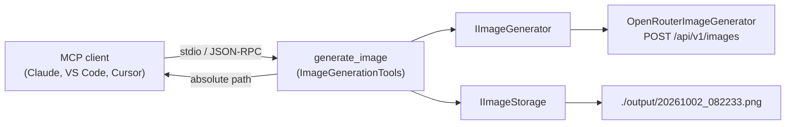

# Image Generation MCP Server (.NET)

A local [Model Context Protocol](https://modelcontextprotocol.io/) (MCP) server, written in C# / .NET 10, that lets AI assistants such as Claude Code, Claude Desktop, VS Code (GitHub Copilot) and Cursor **generate images from a text prompt**.

Images are generated through [OpenRouter](https://openrouter.ai/), saved as PNG files in a local `./output` folder, and the **absolute file path is returned to the LLM** so it can open, show or further process the image.

The image provider sits behind an `IImageGenerator` interface, so OpenRouter can be replaced by another backend (OpenAI, Azure, a local model, ...) without touching the MCP tool.

---

## Features

- 🖼️ One MCP tool, `generate_image`, with `prompt`, `model`, `quality` and `aspectRatio` parameters
- 🔌 Provider-agnostic design (`IImageGenerator`); OpenRouter implementation included
- 💾 Saves images as `output/yyyyMMdd_HHmmss.png` (e.g. `20261002_082233.png`). The folder is created automatically, and images created in the same second get a `_1`, `_2`, ... suffix
- 🧭 Returns the absolute file path, plus model, quality, size and cost
- 📋 Structured console logging (to stderr) so you can see what is happening
- 🧪 Unit tests that don't hit the network
- Scaffolded with the official `Microsoft.McpServer.ProjectTemplates` (`dotnet new mcpserver`)

## How it works



1. The MCP client starts the server as a child process and talks to it over **stdio**.
2. The LLM calls `generate_image`.
3. `OpenRouterImageGenerator` calls `POST https://openrouter.ai/api/v1/images` with `output_format: "png"` and decodes the base64 image.
4. `LocalImageStorage` writes the PNG into the output folder.
5. The tool returns the absolute path to the LLM.

## Prerequisites

- [.NET 10 SDK](https://dotnet.microsoft.com/download/dotnet/10.0)
- An [OpenRouter API key](https://openrouter.ai/keys) with credits

## Quick start

```bash
git clone https://github.com/LukasMomot/image-generation-mcp.git
cd image-generation-mcp
dotnet build
dotnet test
```

Run it manually (it will wait for MCP messages on stdin; press `Ctrl+C` to stop):

```bash
export OPENROUTER_API_KEY=sk-or-v1-...
dotnet run --project src/ImageGenerationMcp
```

## Configuration

All configuration is done through environment variables, which you usually set in your MCP client's config:

| Variable | Required | Default | Description |
|---|---|---|---|
| `OPENROUTER_API_KEY` | **yes** | – | Your OpenRouter API key. It is never written to the logs. |
| `IMAGE_GEN_DEFAULT_MODEL` | no | `openai/gpt-image-2.5-flare` | Model used when the tool call does not pass `model`. |
| `IMAGE_GEN_OUTPUT_DIR` | no | `./output` | Where images are saved. Relative paths resolve against the server's **working directory**; see the note below. |
| `OPENROUTER_BASE_URL` | no | `https://openrouter.ai/api/v1/` | Override the API endpoint, e.g. for a proxy. |
| `Logging__LogLevel__Default` | no | `Information` | Log level (`Debug`, `Information`, `Warning`, ...). |

> **Where does `./output` end up?** It is relative to the directory the MCP client starts the server in.
> - Claude Code and VS Code usually start it in your project/workspace folder.
> - Claude Desktop starts it in `/` on macOS, which is not writable.
>
> If in doubt, set `IMAGE_GEN_OUTPUT_DIR` to an absolute path. The resolved folder is printed in the startup log.

## Tool reference: `generate_image`

| Parameter | Type | Required | Default | Description |
|---|---|---|---|---|
| `prompt` | string | yes | – | Description of the image to generate. |
| `model` | string | no | `IMAGE_GEN_DEFAULT_MODEL` | Any OpenRouter image model id, e.g. `openai/gpt-image-2.5-flare`. |
| `quality` | string | no | `medium` | `auto`, `low`, `medium`, `high`, `xhigh`, `max`. Higher is slower and more expensive. |
| `aspectRatio` | string | no | `3:2` | `W:H` such as `1:1`, `3:2`, `2:3`, `4:3`, `3:4`, `16:9`, `9:16`, `21:9`, or `auto`. |

The `quality` and `aspectRatio` values are passed to OpenRouter as-is. Which values work depends on the model; the table lists the values supported by `openai/gpt-image-2.5-flare`. An unsupported value results in an error message from OpenRouter, which is shown to the LLM.

**Example result** returned to the LLM:

```text
Image generated successfully.
Path: /Users/me/projects/demo/output/20261002_082233.png
Model: openai/gpt-image-2.5-flare
Quality: medium
Aspect ratio: 3:2
Size: 1843.2 KB
Cost: $0.04
```

If something goes wrong (missing key, no credits, invalid parameter, timeout), the tool returns an error result with a readable message instead of a path.

## Using it in MCP clients

Each example below runs the server from source with `dotnet run`. Replace `/absolute/path/to/image-generation-mcp` with your clone location.

> 💡 **For daily use, publish once** so the client doesn't build on every start, which is faster and avoids client start-up timeouts:
> ```bash
> dotnet publish src/ImageGenerationMcp -c Release -o publish
> ```
> Then use `"command": "/absolute/path/to/image-generation-mcp/publish/ImageGenerationMcp"` (on Windows, `...\publish\ImageGenerationMcp.exe`) with no `args`.

### Claude Code

```bash
claude mcp add image-gen \
  -e OPENROUTER_API_KEY=sk-or-v1-... \
  -e IMAGE_GEN_DEFAULT_MODEL=openai/gpt-image-2.5-flare \
  -- dotnet run --project "/absolute/path/to/image-generation-mcp/src/ImageGenerationMcp"
```

- Add `-s user` to make it available in all your projects. Without it, the server is only added for the current project.
- Check it with `claude mcp list` or `/mcp` inside a session.

Alternatively, commit a project-scoped `.mcp.json`. Claude Code expands `${VAR}` from your shell environment, so the key is not committed:

```json
{
  "mcpServers": {
    "image-gen": {
      "command": "dotnet",
      "args": ["run", "--project", "/absolute/path/to/image-generation-mcp/src/ImageGenerationMcp"],
      "env": {
        "OPENROUTER_API_KEY": "${OPENROUTER_API_KEY}"
      }
    }
  }
}
```

Then ask: *"Generate a 16:9 image of a lighthouse at dawn and describe what you see."* Claude Code calls the tool and can then read the PNG at the returned path with its file-reading tool.

### Claude Desktop

Edit `claude_desktop_config.json`:
- macOS: `~/Library/Application Support/Claude/claude_desktop_config.json`
- Windows: `%APPDATA%\Claude\claude_desktop_config.json`

```json
{
  "mcpServers": {
    "image-gen": {
      "command": "/usr/local/share/dotnet/dotnet",
      "args": ["run", "--project", "/absolute/path/to/image-generation-mcp/src/ImageGenerationMcp"],
      "env": {
        "OPENROUTER_API_KEY": "sk-or-v1-...",
        "IMAGE_GEN_OUTPUT_DIR": "/Users/<you>/Pictures/ai-images"
      }
    }
  }
}
```

Restart Claude Desktop afterwards.
- Use the **full path** to `dotnet` (run `which dotnet`), because Claude Desktop doesn't load your shell `PATH`.
- Always set `IMAGE_GEN_OUTPUT_DIR` here (see the note above).
- Claude Desktop cannot read local files on its own. To let it *look* at the generated image, also add a filesystem MCP server that has access to the output folder.

### VS Code (GitHub Copilot agent mode)

`.vscode/mcp.json`. The API key is requested once and stored securely by VS Code:

```json
{
  "inputs": [
    { "type": "promptString", "id": "openrouter-key", "description": "OpenRouter API key", "password": true }
  ],
  "servers": {
    "image-gen": {
      "type": "stdio",
      "command": "dotnet",
      "args": ["run", "--project", "${workspaceFolder}/src/ImageGenerationMcp"],
      "env": {
        "OPENROUTER_API_KEY": "${input:openrouter-key}"
      }
    }
  }
}
```

### Cursor

`~/.cursor/mcp.json` (global) or `.cursor/mcp.json` (project):

```json
{
  "mcpServers": {
    "image-gen": {
      "command": "dotnet",
      "args": ["run", "--project", "/absolute/path/to/image-generation-mcp/src/ImageGenerationMcp"],
      "env": {
        "OPENROUTER_API_KEY": "sk-or-v1-...",
        "IMAGE_GEN_OUTPUT_DIR": "/absolute/path/to/output"
      }
    }
  }
}
```

### Other clients

Any MCP client that supports **stdio** servers works. Configure:
- command `dotnet`
- args `run --project <path-to>/src/ImageGenerationMcp` (or the published executable)
- the environment variables listed above

## Logging

Logs are written to the console through `Microsoft.Extensions.Logging`, on **stderr**. stdout is reserved for the MCP JSON-RPC protocol, so anything else written there would break the connection. Example:

```text
2026-10-02 08:22:31 info: ImageGenerationMcp[0] Image Generation MCP server starting (provider: OpenRouter, base URL: https://openrouter.ai/api/v1/)
2026-10-02 08:22:31 info: ImageGenerationMcp[0] Default model: openai/gpt-image-2.5-flare
2026-10-02 08:22:31 info: ImageGenerationMcp[0] Output directory: /Users/me/projects/demo/output
2026-10-02 08:22:31 info: ImageGenerationMcp[0] OpenRouter API key: configured
2026-10-02 08:22:33 info: ImageGenerationMcp.Tools.ImageGenerationTools[0] generate_image called: model=openai/gpt-image-2.5-flare (default), quality=medium, aspectRatio=3:2
2026-10-02 08:22:33 info: ImageGenerationMcp.Providers.OpenRouter.OpenRouterImageGenerator[0] Requesting image from OpenRouter: model=openai/gpt-image-2.5-flare, quality=medium, aspectRatio=3:2, promptLength=58
2026-10-02 08:22:51 info: ImageGenerationMcp.Providers.OpenRouter.OpenRouterImageGenerator[0] OpenRouter responded 200 in 18234 ms
2026-10-02 08:22:51 info: ImageGenerationMcp.Providers.OpenRouter.OpenRouterImageGenerator[0] Image received: 1887436 bytes, mediaType=image/png, cost=0.04
2026-10-02 08:22:51 info: ImageGenerationMcp.Storage.LocalImageStorage[0] Image saved to /Users/me/projects/demo/output/20261002_082233.png (1887436 bytes)
```

- Set `Logging__LogLevel__Default=Debug` to also log the full prompt.
- Set `Logging__LogLevel__System.Net.Http.HttpClient=Information` to see raw HTTP request logs.

## Debugging

### 1. MCP Inspector (recommended)

The [MCP Inspector](https://github.com/modelcontextprotocol/inspector) is a web UI for listing tools and calling them by hand:

```bash
npx @modelcontextprotocol/inspector \
  -e OPENROUTER_API_KEY=sk-or-v1-... \
  dotnet run --project src/ImageGenerationMcp
```

1. Open the URL it prints and click **Connect**.
2. Go to **Tools → List Tools → generate_image**, fill in a prompt, and click **Run Tool**.
3. Server logs (stderr) appear in the Inspector's notifications/console panel and in your terminal.

### 2. Talk to it over raw stdio

Useful for checking the server starts and lists its tools without any client. This doesn't call OpenRouter, so it's free:

```bash
printf '%s\n' \
  '{"jsonrpc":"2.0","id":1,"method":"initialize","params":{"protocolVersion":"2025-06-18","capabilities":{},"clientInfo":{"name":"cli","version":"1"}}}' \
  '{"jsonrpc":"2.0","method":"notifications/initialized"}' \
  '{"jsonrpc":"2.0","id":2,"method":"tools/list"}' \
  | dotnet run --project src/ImageGenerationMcp 2>server.log
```

stdout shows the JSON-RPC responses; `server.log` contains the logs.

### 3. Attach a debugger

1. Start the server through the Inspector (or your MCP client).
2. Attach to the running `ImageGenerationMcp` process:
   - **VS Code** (C# Dev Kit): *Run and Debug → .NET: Attach to a .NET process*.
   - **Visual Studio**: *Debug → Attach to Process*.
   - **Rider**: *Run → Attach to Process*.
3. Set breakpoints in `ImageGenerationTools.GenerateImage` or `OpenRouterImageGenerator.GenerateAsync` and call the tool from the Inspector.

### 4. Where do the client logs live?

| Client | Logs |
|---|---|
| Claude Code | `/mcp` shows status; start with `claude --debug` for MCP server stderr |
| Claude Desktop (macOS) | `~/Library/Logs/Claude/mcp-server-image-gen.log` and `mcp.log` |
| Claude Desktop (Windows) | `%APPDATA%\Claude\logs\` |
| VS Code | *MCP: List Servers → image-gen → Show Output* |
| Cursor | *Output* panel → *MCP Logs* |

> ⚠️ Never use `Console.WriteLine` in this project. Anything written to stdout corrupts the MCP protocol stream. Use `ILogger` instead.

## Troubleshooting

| Symptom | Cause / fix |
|---|---|
| `OpenRouter API key is not configured` | `OPENROUTER_API_KEY` is not set in the MCP client's `env` block. |
| `OpenRouter returned HTTP 401` | The key is invalid or revoked. |
| `OpenRouter returned HTTP 402` | Not enough credits on your OpenRouter account. |
| `OpenRouter returned HTTP 400: ...` | The model doesn't support the given `quality` or `aspectRatio`, or the model id is wrong. Check the model page on openrouter.ai. |
| `request timed out after 300 seconds` | High quality settings can be slow; try `quality: low/medium`. |
| `could not be saved: Read-only file system` | The working directory isn't writable (common with Claude Desktop). Set `IMAGE_GEN_OUTPUT_DIR` to an absolute path. |
| Server shows as failed/disconnected in the client | Check the client logs (see above). Make sure `dotnet` is on the client's `PATH` or use its full path, and that `dotnet build` succeeds. |

## Project structure

```text
├── ImageGenerationMcp.sln
├── src/ImageGenerationMcp/
│   ├── Program.cs                         # Host, logging, configuration, DI, MCP registration
│   ├── Abstractions/                      # Provider-agnostic contracts
│   │   ├── IImageGenerator.cs
│   │   ├── ImageGenerationRequest.cs
│   │   ├── GeneratedImage.cs
│   │   └── ImageGenerationException.cs
│   ├── Configuration/                     # Options + defaults (model, quality, aspect ratio, output dir)
│   ├── Providers/OpenRouter/              # OpenRouter implementation of IImageGenerator
│   ├── Storage/                           # IImageStorage + LocalImageStorage (timestamped PNG files)
│   ├── Tools/ImageGenerationTools.cs      # The generate_image MCP tool
│   └── .mcp/server.json                   # MCP server metadata for NuGet / MCP registry
└── tests/ImageGenerationMcp.Tests/        # xUnit tests (no network)
```

## Adding another image provider

1. Implement `IImageGenerator`:

   ```csharp
   public sealed class MyProviderImageGenerator(HttpClient http) : IImageGenerator
   {
       public async Task<GeneratedImage> GenerateAsync(ImageGenerationRequest request, CancellationToken ct = default)
       {
           // call your API, then:
           return new GeneratedImage(pngBytes, "image/png", request.Model, cost: null);
       }
   }
   ```

   Throw `ImageGenerationException` with a readable message on failure. That message is shown to the LLM.

2. Register it in `Program.cs` instead of the OpenRouter one:

   ```csharp
   builder.Services.AddHttpClient<IImageGenerator, MyProviderImageGenerator>();
   ```

The MCP tool, storage and logging stay the same.

## Publishing as a .NET tool (optional)

The project was created from the official MCP server template, so it can be packed as a NuGet MCP server package and run with `dnx`:

```bash
dotnet pack src/ImageGenerationMcp -c Release
dotnet nuget push src/ImageGenerationMcp/bin/Release/*.nupkg --api-key <key> --source https://api.nuget.org/v3/index.json
```

Clients can then use `"command": "dnx", "args": ["ImageGenerationMcp", "--yes"]`. Before publishing, update `PackageId` in the `.csproj` and the placeholders in `.mcp/server.json`. See the [Microsoft guide](https://learn.microsoft.com/dotnet/ai/quickstarts/build-mcp-server).

## Built with

- [ModelContextProtocol C# SDK](https://github.com/modelcontextprotocol/csharp-sdk)
- [Microsoft.McpServer.ProjectTemplates](https://learn.microsoft.com/dotnet/ai/quickstarts/build-mcp-server)
- [OpenRouter Images API](https://openrouter.ai/docs/guides/overview/multimodal/image-generation)
